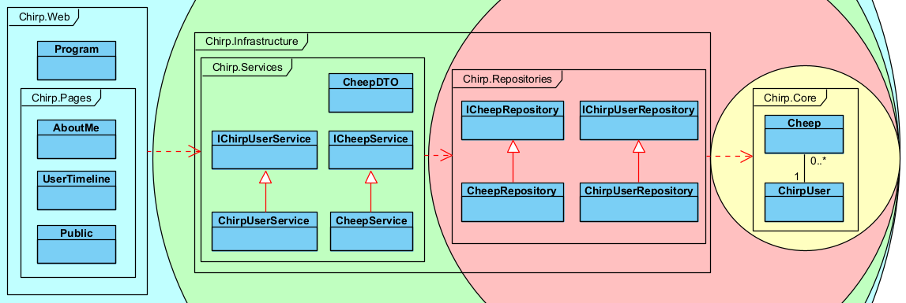
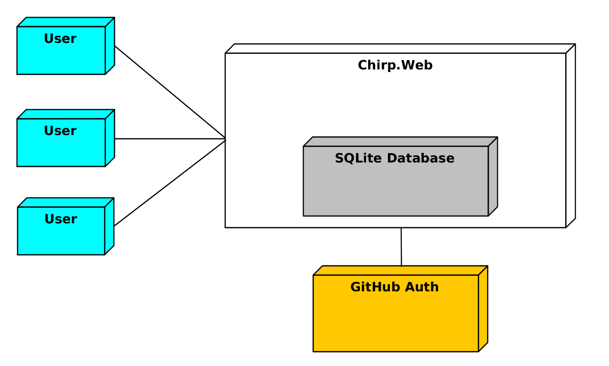
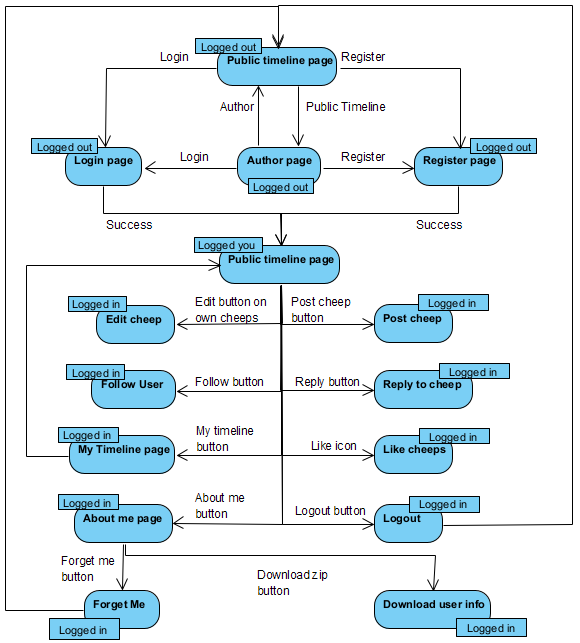
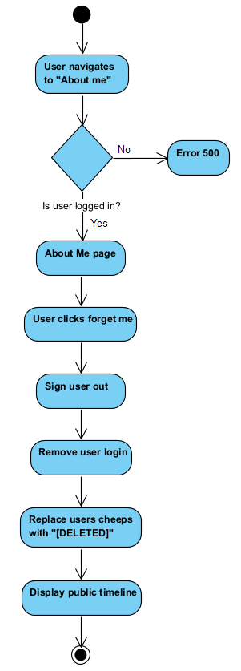
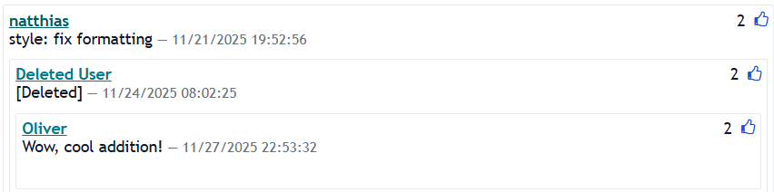
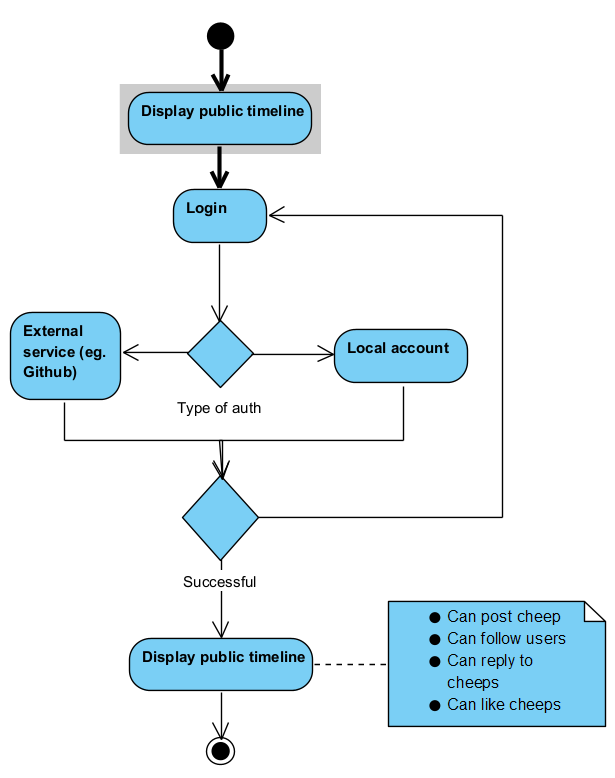
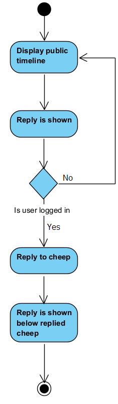
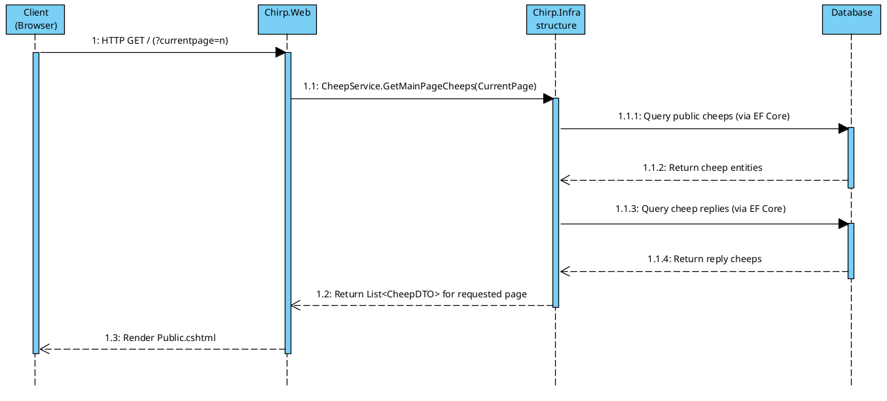

---
header-includes:
- \usepackage{float}
- \floatplacement{figure}{H}
---

# Design and Architecture of _Chirp!_

## Domain model

## Architecture — In the small
Below is an onion architecture diagram to illustrate the overall architecture of the _Chirp!_ application. 
The diagram also illustrates dependencies, where the outer circles depend on the inner circles.


### Domain entities
In yellow is the center of the architecture as _Chirp.Core_.
This layer stores the most fundamental parts of the codebase. 
In this project _Chirp.Core_ stores the _Cheep_ and _ChirpUser_ domain model.

### Repository layer
In red is the infrastructure layer of the codebase. 
This layer is responsible for retrieving domain relevant information from the database. 

### Service layer
In orange is the service layer. 
This layer is responsible for translating the domain models into _DTOs_ (Data Transfer Object) and connect requests to the UI. 
This layer therefore acts as a binder between the infrastructure and the UI layer. 
When a user request is received the service layer handles that requests, 
retrieves information from the infrastructure layer, and translates the information received into _DTOs_.
These _DTOs_ are then used by the UI to display information and data to the user.

### UI layer
In blue is the UI layer.
Here the UI is displayed to the user via `.cshtml` pages. 
Here _page models_ sent user requests to the service layer and decide the state which to display for the user.
The state can change over the lifetime of the application, for example, when the user is logged in. 
Logging in changes the formatting of the pages, which the _page models_ are responsible for handling. 

## Architecture of deployed application
Our website is hosted on Azure via their App Service on their free F1 plan. This allows us to host our website online with SSL certification.
Although this plan does come with some restrictions, such as a maximum of 1 hour of shared vCPU time every day, it still allows us to test our application in a live, production environment.

### Diagram of deployed application

Since clients can login via OAuth (GitHub), our service would be dependent on the availability of GitHub as an auth provider for OAuth users to login.


## User activities
This segment will focus on some of the typical scenarios and user journeys throughout the _Chirp!_ application. 
First we will document what features are accessible to the user when unauthorised and authorised, 
and then go into more details about some of the most important features of the application.

### Activity diagram for unauthorised- and authorised users
Below is an activity diagram illustrating what actions the user can take when they are both authorised and unauthorised.

{ width=90% } 


### Follow User
Below is an activity diagram illustrating what happens when a user tries to follow another user. 
Following has the effect of adding the followed user's _Cheeps_ to one's _My Timeline_. 
Following is therefore essential when two users wants to see what new _Cheeps_ the other posts 

{ width=75% }

### _Forget Me!_ (Deleting user)
The diagram below shows the actions performed when a user tries to delete their data.
This feature is called _Forget Me!_ in the _Chirp!_ application, and can be performed under the `/user/<username>/about` endpoint.
It is worth noting that the _About Me_ site exists for every user, but the information
on the site is only loaded for the user who is authenticated on the platform, meaning,
_user1_ cannot access the _About Me_ for _user2_. 

{ width=50% }

When deleting user data, shown in the illustration after "User clicks forget me", an important design decision had to be made.
Normally in a lot of systems when the user deletes their data, they expect it to be deleted.
The effect of this can be obtained by either soft deleting or hard deleting user data and information.
Before GDPR a lot of software used to just mark data as "deleted" in databases and never query them again. 
Now, because of GDPR, it is mandatory by law to always delete or anonymise user data when requested to do so, 
or when its no longer necessary to keep that data stored[^userdata_deletion].

Hard deletes often create a lot of problems behind the scenes, problems like syncing, irreversible data loss and compromising database schema integrity. 
For the _Chirp!_ application there was the issue of what to do with [replies](#Activity_Reply). 
Since replies are linked with a _Cheep_ parent-child relation, deleting a parent _Cheep_ would result in all subsequent child _Cheeps_ being deleted.
This is why we opted for a deletion style more reminiscent of Reddit. 
In Reddit posts and replies made by the user are not deleted, but simple noted as _Deleted by user_.
With this method users wont lose their replies, simply because the author of the main _Cheep_ decided to delete their post. 
An example of the visual effect of anonymisation of user data can be seen below.



### Login
When a user tries to log in they have the option of either a application-scoped account or using GitHub as an external login service.
When a user logs in with GitHub, user data necessary for the application is automatically fetched. 
Information like a users GitHub username is used as their _Chirp!_ username.
The user is therefore auto-redirected to the public timeline, when GitHub returns a valid authorisation.
Below is a diagram of a typical scenario of a user logging into the _Chirp!_ application. 

{ width=100% }

### Reply {#Activity_Reply}
Below is an illustration of how a user would reply to another users _Cheep_. 
When designing replies it was chosen to use the same _Cheep_ entity as both a "root post" and the following replies to said post.
This method was chosen because we wished to design a _thread_ style of replies, like Reddit. 
Instead of only having one layer of replies, users could now reply to other peoples replies, and continue a _thread_ of replies.
Using the same entity for this, made both the UI and logic simple and DRY, by simply using recursion.
Below is a diagram of a typical scenario of a user replying to another user in the _Chirp_ application. 

{ width=35% }

## Sequence of functionality/calls trough _Chirp!_
Below is a UML sequence diagram illustrating the sequence of calls in the _Chirp!_ application when it receives an HTTP `GET /` request from a client, corresponding to a request for the _Public Timeline_. More specifically, the diagram focuses on the calls relevant to retrieving and displaying the _Public Timeline_ _Cheeps_. The diagram is intentionally kept at an architectural level of abstraction. It therefore emphasises the collaboration between the main system components (`Chirp.Web`, `Chirp.Infrastructure`, and the database), rather than the internal implementation details. As a result, certain methods (e.g. `Public.OnGet()`) have been deliberately omitted. This abstraction is chosen to keep the diagram readable while still conveying the essential technical flow through the application’s layered architecture. The intention is to depict how a user’s incomming request is handled end-to-end, from the incoming HTTP request to data retrieval and the final rendering of the _Public Timeline_ with the relevant _Cheeps_.

{ width=100% }

# Process
Screenshot From 2025-12-19 13-14-31
## Build, test, release, and deployment
For building, releasing and testing GitHub Actions was used. 

### Building & Releasing
The script `release.yml` was used for building and releasing the project. The script uses a matrix of `[linux-x64, linux-arm64, win-x64, win-arm64, osx-x64, osx-arm64]` to create release artifacts on each release. When releasing a new version [release please](https://github.com/googleapis/release-please) was used to generate commit logs. 

### Testing
The script `coverage.yml` was used for checking if test suites existed for each package in the solution, after testing the script uses [reportgenerator](https://github.com/danielpalme/ReportGenerator) to generate a coverage report we could use to analyze the test coverage and quality of tests. This is discussed more in \ref{testPhilosophy}.

### Versioning
Before the lecturers introduced us to semantic versioning and told us it was a requirement, we used CalVer[^calver].
CalVer was initially chosen, as it uses the calendar date for versioning, and seemed to be a good way to coordinate our weekly releases. [^release-retag]

Once we switched to semantic versioning we decided that it would make sense to automate this process.
The tool we used to automate this was [Release Please](https://github.com/googleapis/release-please) from Google.
Release Please continuously monitors the git history of a project through a GitHub action.
The action identifies commits which use the [conventional commit](https://www.conventionalcommits.org/en/v1.0.0/) standard and generates a release log based on changes in its own branch.
The action also opens a pull request, which when merged, merges the changelog into main and creates a new release with the changelog added as a description.
This helped give us an, and potential users, an overview over what has changed between releases.

In addition to this, Release Please also automatically computes the next version number based on the ```feat```, ```fix```, and ```feat!``` tags from conventional commit.
This was nice, as we did not have to consider what our next release number should be.

One issue we faced with this was we ended up with a rather high major version (5.x.y).
The reason for this was our failure to consider what was actually a breaking change.
We followed the convention of tagging any breaking API change as a breaking change, which would make release please update the major version[^semver-lecture-notes].
However, these breaking API changes were often only breaking for internal APIs, for many major releases, no user-facing APIs changed.
We should not have considered these internal API changes as breaking, since, for the end user, these changes were not breaking.
What we should have considered a breaking change should be the switch from a **CLI** to a **web page**, and potentially **the addition of identity**.
This would mean that _Chirp!_ would be on **v3.x.y** or **v2.x.y**, depending on whether the addition of identity was considered breaking, not **v5.x.y**.

### Deployment
Whenever we deploy our code to GitHub, a number of GitHub Actions scripts will be run. These can be found the .github/workflow directory.
- coverage.yml: Runs a code coverage test and fails upon not reaching the set threshold
- format.yml: Runs dotnet format, which maintains a certain code standard in our code. These formatting commits have been attributed to our group member natthias
- main_bdsagroup13chirprazor.yml: Builds and deploys our code to our Azure Webapp instance, using our GitHub Secrets to access login information. This file was auto-generated by Azure and afterwards customised for our needs by a group member.
- release.yml: Builds and publishes our project to our GitHub repository, with builds for different operating systems.

### Linear git history
Initially, we did not enforce a linear git history as a requirement for our project, but it was a soft requirement to attempt to keep the history linear.
However, after [#87381](https://github.com/ITU-BDSA2025-GROUP13/Chirp/commit/873815545bb6ee80dd3c203ff9a895471815e3a6), we decided to enforce a linear history on the project through the git repo settings.

There are many reasons for enforcing a linear history.
For one, having a linear history makes managing and maintaining a project easier.
It is much easier to understand when a certain feature was added, as each commit is a patch, which cleanly applies atop the previous commit.

It also allows for external tools, such as ```git bisect``` to traverse the commit graph easier.
Since a linear history is just a line, it is much easier for ```git bisect``` to perform a binary search and find when a regression was introduced.
On the other hand, when the commit graph is a large interleaving of commits and merge commits, it can be difficult to perform a binary search.
This does not mean it is impossible to perform a binary search on a non-linear history, but the cognitive load on the developer is increased.

It also allows for easier code review.
Since each commit cleanly applies atop the previous, there is no extra noise generated by merge commits.
It is simply a set of patches to apply to the main branch.

Finally, one of the primary reason we used a linear git history was for external tooling.
We used an action called release-please for automated changelog generation.
This tool recommended a linear history to ease parsing of the commit graph[^release-please-linear].

The workflow for a linear git history is rather simple.
When a commit is ready to be merged with the main branch, you ```git rebase origin/main```, changes the base of the branch to be the current *HEAD* of the main branch.
This might introduce merge conflicts, which you resolve as normal.
Once the conflicts have been resolved, and the PR has been approved, it can be merged with ```git merge --ff-only```.

Having a linear git history is one way to manage a project which comes with its set of benefits.
However, having a non-linear history has its own set of benefits.
Chiefly, some metadata is lost when a branch is rebased, since the commit the branch was initially based on has changed.
In addition to this, a non-linear history can make the history of long-lived feature branches more clear, however, since we used trunk-based development this was not a concern for us.

## Team work
### Trunk-based development
During the development of this project, we tried trunk-based development for the first time. Trunk-based development is a source-control strategy centered on frequent integration of small batches of work into the main branch (trunk), rather than long-lived feature branches, as is common in many other popular workflows, e.g., GitFlow.

Throughout the development process, we didn’t completely avoid long-lived branches. Many times, it proved utterly impractical to adhere to the “merge every day” mantra, which was (admittedly) partly due to our inexperience with the workflow.

Being able to merge every day depends on the assumption that the given task can be completed and reviewed within that timeframe. However, estimating the time needed to complete tasks was not always straightforward, especially for larger tasks that don’t naturally split into logically independent subtasks. An example of such a task is the large rewrite required to migrate from raw SQLite to EF Core. Merging at any point between starting and finishing this task would result in a broken main branch. Of course, this is an extreme example, and often it would also be due to interpersonal dynamics within the team. Waiting for code review, from team members with their own daily lives, schedules, and responsibilities, also sometimes resulted in longer branch lifespans. 

So, in these cases, we opted to let the branches live a bit longer rather than merge unfinished or unreviewed code, as we value high-quality code over minimizing branch staleness.

## How to make _Chirp!_ work locally
The get the application running locally either clone this repository or alternatively download the [latest release](https://github.com/ITU-BDSA2025-GROUP13/Chirp/releases/tag/v5.5.0) for your OS.
While _Chirp!_ will run without a GitHub OAuth client, _Chirp!_ will have degraded functionality if you do not have one.
To create a GitHub OAuth client follow [these instructions](https://github.com/itu-bdsa/lecture_notes/blob/main/sessions/session_08/README_PROJECT.md#1b-oauth-via-github).

### Running from latest release
**On Windows:**
1. Unzip folder
1. Navigate to `chirp-main-<OS>-<architecture>`
1. Run the `Chirp.Web.exe` file. 

**On Linux & macOS**
1. Unzip folder
1. Navigate to `chirp-main-<OS>-<architecture>`
1. Run `./Chirp.Web`

### Running from repository
1. From the root folder of the project:

   `dotnet run --project src/Chirp.Web/`
1. (Optional) Release artifacts do not contain GitHub OAuth ClientID or ClientSecret, however these can be read from the environment variables ```$authentication__github__clientSecret``` and ```$authentication__github__clientId```[^chirp-port-local]

## How to run test suite locally
All tests, including Playwright, E2E, Integration and Unit tests is stored in the `test` directory. Playwright needs to get downloaded and installed first. Following is the steps to build and run the test suite (all done from the root folder of the project):
1. Build the project (needed for downloading Playwright)

   `dotnet build`


1. Install Playwright for tests

   ```pwsh test/Chirp.E2E.Tests/bin/Debug/net8.0/playwright.ps1 install --with-deps```

1. Run the project tests

   `dotnet test`

### Philosophy behind testing \label{testPhilosophy}
For the project the group had a strict >=80% test coverage requirement for each feature. 
This requirement was set to avoid rollbacks and hotfixes, and instead focus on implementing safe and complete features. 
The requirement was set at 80, to keep the standard high, but also realistic. 

To enforce the requirement a GitHub Action script was used, which ran the test suites on every pull request to main. 
The script used [reportgenerator](https://github.com/danielpalme/ReportGenerator) to also generate a report in which we could better review what parts of the codebase was missing tests.


# Ethics

## License
We chose the [3-Clause BSD License](https://opensource.org/license/bsd-3-clause), which is a permissive, OSI approved license[^osi-approved], open source copyright license.
This license is slightly more restrictive than the MIT License or The 2-clause BSD License.
The license includes a non-endorsement stating that any derivative work may not use the name of the original work, or its authors as an endorsement of the derivative.

We felt that this license was a good choice for an educational project, as it preserves the permissive nature of the MIT License or the 2-Clause BSD License.
This allows for further contributions to the project through a fork, while protecting the original authors and project from both any implications of warranty or liability.

## LLMs, ChatGPT, CoPilot, and others
LLMs were primarily used for research of topics prior to implementing a feature.
Prior to adding a feature, we would conduct research and find all of the necessary libraries required.
Our group found the documentation, especially from Microsoft themselves, to be lacking.
This proved a great use for an LLM, primarily ChatGPT, Claude, or Gemini, to be used in the context of clarifying a subject from various internet sources.
Once a feature had been thoroughly researched, an attempt would be made at implementing the feature in question.
An LLM might assist in the theoretical structure of how this feature would be implemented.
This has often proven to work well, as LLMs are good at reading large amounts of documentation, extracting the important parts, and relaying them to the reader.
We did not consider this as co-authorship, since the actual code from an LLM was not used, neither verbatim nor as inspiration.

Whenever we did co-author an LLM, the commit was annotated with a `Co-authored-by: ChatGPT <chatgpt@openai.com>` footer in the git commit.
This was primarily as a last-ditch effort, when something proved too difficult to implement ourselves.
Here, in order to finish a feature, code generated by an LLM was used, either verbatim, or as inspiration.
This had some success, however, often the code was not quite right, or simply did not work, which can be seen in
[#d2a073e](https://github.com/ITU-BDSA2025-GROUP13/Chirp/commit/d2a073e1b1b22661ef77443b8743a16f81169be4), [#899ca30](https://github.com/ITU-BDSA2025-GROUP13/Chirp/commit/899ca304d89c7574a789b97d656ba86e1622cc49), and [#270892b](https://github.com/ITU-BDSA2025-GROUP13/Chirp/commit/270892b2ba79b96ab14c91c1fa4aa3ca2b563090)
where 3 LLM generated workflows were reverted as they did not work correctly.

Another issue we faced with LLMs was that when researching topics, it would often get confused and start spiraling.
This was likely because the context window of the conversation became too large, which caused the LLM to hallucinate.

[^userdata_deletion]: [KILDE](https://ante.dk/blog/hvornaar-skal-persondata-slettes-ifoelge-gdpr/?utm_source=chatgpt.com)
[^calver]: [CalVer](https://calver.org/)
[^release-retag]: The initial release tag was deleted and tagged again using semver
[^semver-lecture-notes]: [Lecture slides on Semantic Versioning](https://github.com/itu-bdsa/lecture_notes/blob/main/sessions/session_03/Slides.md#semantic-versioning)
[^release-please-linear]: [Release Please documentation about linear history](https://github.com/googleapis/release-please#linear-git-commit-history-use-squash-merge)
[^osi-approved]: [OSI approved licenses](https://opensource.org/licenses)
[^chirp-port-local]: Release artifacts run on port :5000, not :5273
